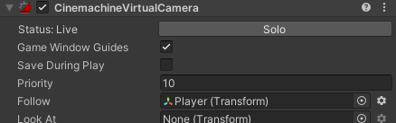

##Animacija

Sada naš Player je samo nepomična slika. Pa ćemo animacije za kretanje igrača.
Napraviti folder Animations. Ući u folder, desni klik Create i naći Animations te kliknuit.
Animaciju nazvati Idle.


Sada drag & drop Idle animaciju na game objeckt Player.
I treba da se pojavi ovo.


Sada dupli kilk na Idle animaciju  i treba da se pojavi prozor **Animation**. I dupli klika na game objekt Player.


I odabarti Idle animaciju.

Sada otići u folder u kojem se nalazi Idle animacija od našeg odabranog Playera. Te sve isječene slike iz slike Idle drag & drop u pozor **Animation**.
Te onda, ukoliko nema **Sample Rate** kliknuti 3 tačke te odabrati **Show Sample Rate**, i postavit na odgovarajuću brzinu po želji i kliknuti Play.
I animacija bi tebala da radi.


Te sada kliknuti na animaciju, plavi trougao, i checkirati **Loop Time**. Ukolko to ne uradimo, kada pokrenemo igro animacija će proći kroz jedan ciklus i stati.


Sada pokrenuti igru. Sada ćemo napravit animaciju za kratanje. Naći sliku Run, isjeći i ponoviti porces.

Kada ste to uradili, **Windows --> Animation --> Animator**.


Sada desni kliknuti na pravougaonik Idle, **Make Transition**, te spojiti sa animacijom Run. Spojiti i obrnuto.


Sada kliknuti na liniju što spaja Idle i Run. Unchekovati **Has Exit Time** i postavti **Transition Duration** na 0.


Uradti isto i za drugi tansition iz Run u Idle.
Sada u **Parameters** kliknuti '+' --> **Bool** i nazavti ga 'running'.

I sada u transitions **Conditions** '+'. Treba da se pojavi naš **running**, u idle->run postaviti na **true**, a run->idle **false**.


U Inspectoru-> Sprite Renderer naći Flip i checkirati X, to prouzrokuje da se sprite od Playera okrane na lijevu stranu, flipuje se vertikalno.
Uncheckirati to sad.
Otvoriti skriptu PlayerMovement i napraviti funkciju Animaton.

```csharp

using System.Collections;
using System.Collections.Generic;
using UnityEngine;

public class PlayerMovement : MonoBehaviour
{
    private Rigidbody2D rb;

    public float move_speed = 7f;
    public float jump_speed = 7f; 

    private BoxCollider2D coll;
    [SerializeField] private LayerMask ground;

    private Animator anim;//napraviti variablu anim
    private SpriteRenderer sprite;//i sprite

    float dirX = 0;//deklariasti dirX

    private void Start()
    {
        rb = GetComponent<Rigidbody2D>();
        coll = GetComponent<BoxCollider2D>();
        anim = GetComponent<Animator>();//dodati komponente za Animator
        sprite = GetComponent<SpriteRenderer>();//i SpriteRenedrer
    }

    
    private void Update()
    {
        dirX = Input.GetAxis("Horizontal");
        rb.velocity = new Vector2(dirX * move_speed , rb.velocity.y);

        if(Input.GetButtonDown("Jump") && IsGrounded())
        {
            rb.velocity = new Vector2(rb.velocity.x,jump_speed);
        }
        Animation();//pozvati funkciju
    }

    private bool IsGrounded()
    {
        return Physics2D.BoxCast(coll.bounds.center, coll.bounds.size, 0f, Vector2.down, .1f, ground);
    }

    private void Animation()
    {
        
        if(dirX > 0f)//provjeravamo da li je dirX > 0, tj. da li se karakter kreće desno
        { 
            anim.SetBool("running", true);//postavljmo naš condition running na true
            sprite.flipX = false;//ovo nam postavlja u inspectoru u Sprite Rendereru filpX na false i plazer ponovno gleda na desno
        }
        else if(dirX < 0f)//provjeravamo da li je dirX > 0, tj. da li se karakter kreće lijevo
        {
            anim.SetBool("running", true);//postavljmo naš condition running na true
            sprite.flipX = true;//ovo nam flipa sprite od Playera na lijevu  stranu po vertikalno

        }
        else 
        {
            anim.SetBool("running", false);//ako nije pritisnuta tipka za kretanje vraća bool u false, te se animacija vraća u idle
           
        }
        
    }
}

```

Sada napraviti animacije za skakanje i padanje(Jump and fall). To je samo po jedna slika.
Sada u animatoru ih spojiti. Svaku animacjiu sa svakom.


>Napomena: Transition između svake animacije traba da ima Transition Duration 0 i Has Exit Time uncheckovan.

Sada pošto imamo 4 animacije, zbog lakšeg određivanja koja animacija trba da bude, napraviti ćemo posebnu varijablu i uslov za to.
Obrisati 'running' parametar, te napraviti novi koji će biti int i nazvati ga 'state'.
Taj prametar će ići od 0 do 3.

> 0 - idle

> 1 - run

> 2 - jump

> 3 - fall

Sad u transition između svkai od njih dodati uslov.


U sredini u svakom transitionu postaviti na 'Equals', te poztavti broj za odrđenu animaciju. Na koju animaciju strelica pokazuje, stavti broj od te animacije.

Sada otvoriti skriptu sa animacijom.

```csharp
using System.Collections;
using System.Collections.Generic;
using UnityEngine;

public class PlayerMovement : MonoBehaviour
{
    private Rigidbody2D rb;

    public float move_speed = 7f;
    public float jump_speed = 7f; 

    private BoxCollider2D coll;
    [SerializeField] private LayerMask ground;

    private Animator anim;
    private SpriteRenderer sprite;

    float dirX = 0;

    private enum MovementState{idle, run, jump, fall};//parvimo enum(u c# to je nešto slčno listi intigera)
    //koji imaju indekse od 0 do 3

    private void Start()
    {
        rb = GetComponent<Rigidbody2D>();
        coll = GetComponent<BoxCollider2D>();
        anim = GetComponent<Animator>();
        sprite = GetComponent<SpriteRenderer>();
    }

    
    private void Update()
    {
        dirX = Input.GetAxis("Horizontal");
        rb.velocity = new Vector2(dirX * move_speed , rb.velocity.y);

        if(Input.GetButtonDown("Jump") && IsGrounded())
        {
            rb.velocity = new Vector2(rb.velocity.x,jump_speed);
        }
        Animation();
    }

    private bool IsGrounded()
    {
        return Physics2D.BoxCast(coll.bounds.center, coll.bounds.size, 0f, Vector2.down, .1f, ground);
    }

    private void Animation()
    {
        MovementState state;//lokalna varijabla state koja će imati vrijedosti iz onog gore enuma
        
        if(dirX >0)
        {
            state = MovementState.run;//postavljamo state to run(1)
            sprite.flipX = false;
        }
        else if(dirX < 0)
        {
            state = MovementState.run;//postavljamo state to run(1)
            sprite.flipX = true;

        }
        else 
        {
            state = MovementState.idle;//postavljamo state to idle(0)
           
        }

        if(rb.velocity.y > 0.1)//ovjde ponovo parvimo if uslov, zato što igrač može da se kreće kada skače, pa bi animacija bila run.
        //Pa stvljamo ispod da se state prebaci u jump ili fall
        {
            state = MovementState.jump;//postavljamo state to jump(2)
        }
        else if( rb.velocity.y < -0.1)
        {
            state = MovementState.fall;//postavljamo state to fall(13)
        }

        anim.SetInteger("state", (int)state);//ovo postavlja naš ulsov state postavaljamo vrijednost od 0 do 3, state castiramo u int
        
    }
}


```

##Kamera Follow

Sada primjetimo da kada nam se igrač kreće kamera ostaje na istom mjestu, pa ćemo sada naparavit da se kamera pomjera zajedno sa igračem.

**window --> Package Manager**, odabrati **Unity Registry** i naći **Cinemachine**.


I kliknuti Insatll.

U Hierarchy desni klik, sada bi treabala da se pojavi opcija **Cinemachine** i odabrati **2D Camera**. Sada u u toj kameri u **Folllow** staviti našeg Playera.



I sada kada pokrenemo igru, kamera bi trebal da prati igrača.

