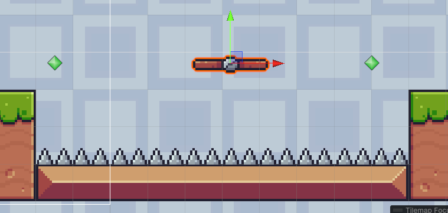

##Item Collect & Count

Sada ćemo da naparvimo logiku i mehaniku kako da naš igrač sakuplja stvari.
U Pixel Adventures 1, naći folder Items, unutar njega Fruits, i odabarti jedanu od opcija.
Te tu sliku isjeći. Napraviti 2D objekt, sprite->square i postaviti mu ime. I napraviti animaciju za to voće. Sada tom game objektu dodati Circle Collider 2D. I namjestiti veličinu Collidera sa slikom, i checkirati Is Trigger. Is Trigger se ponaša tako što detektuje kada nešto uđe u njegove granice, ali ne zaustavlja objekt. Sada ćemo napraviti tag. U Inspectoru **Tag -> Add Tag** imenovati ga imenom voća. Te ponovo, Add Tag i odabrati ga.
Sada ćemo da naprvimo skriptu za detektovanje kada naš igrač dodirne voće.

```csharp
using System.Collections;
using System.Collections.Generic;
using UnityEngine;

public class ItemCollector : MonoBehaviour
{
    // Start i Update nam nisu potrebni za ovu skriptu 
    private void OnTriggerEnter2D(Collider2D collision)//funckija koja porvjerava dali je naš game objekt dodirnuo collider tipa trigger
    {
        if(collision.gameObject.CompareTag("Apple"))//provjerava da li je dodirnuti game objekt ima tag Apple/ime voća
        {
            Destroy(collision.gameObject);//uništavamo taj game objekt, jer kada dodirnemo item, on treba da nestane
        }
    }
}


```
Dodati ovu skriptu na game objekt Player. Pokrenuti igru i porvjeriti dali radi kod.
Sada ćemo da napravimo naš item **prefab**, pošto ćemo da imamo više itema, u slučaju da trabmo nešto da promjenimo, trabali bi smo pormijenuti na svakom game objktu kojeg dupliciramo.  To ćemo uraditi tako što ćemo drag & drop naš item u Asset folder.


Sada bi naš item trebao da poplavi.

Desni klik na naš item i odabrati duplicate.


 I onda ćemo u našoj skripti dodati kod za brojanje.

```csharp
using System.Collections;
using System.Collections.Generic;
using UnityEngine;

public class ItemCollector : MonoBehaviour
{
    private int apple = 0;//naptaviti varijablu za brojanje i postavit joj vrijednost na 0

    private void OnTriggerEnter2D(Collider2D collision)
    {
        if(collision.gameObject.CompareTag("Apple"))
        {
            Destroy(collision.gameObject);
            apple++;
            Debug.Log("Apple: " + apple);//ovo će da nam ispiše u konzoli našu varijblu
       }
    }
}

```
I pokrentu igru i vidjeti da li radi.

Sada ćemo da naprvimo da nam se to ispiše na ekranu od igre. Desni klik u Hierarchy **UI -> Text-TextMeshPro**.


Sada upisati u text "Score: 0 ", promjeniti veličinu fonta po potrebi i postaviti ga u gornji lijevi uago.


Takođe, ovdje odabrati "Top Left", ovo nam služi za kada nam se ekran promjeni(jer nisu svi ekrani od računara iste veličine) da nam text ostane u istoj 
pozici.

Sada ćemo da dovršimo pisanje koda.

```csharp
using System.Collections;
using System.Collections.Generic;
using UnityEngine;
using UnityEngine.UI;//dodati ovo
using TMPro;//i ovo da bismo mogli da radimo sa textom

public class ItemCollector : MonoBehaviour
{
    private int apple = 0;
    [SerializeField] private TMP_Text itemText;//napravti varijablu itemText tipa TMP_Text u koju ćemo da ubacimo naš text

    private void OnTriggerEnter2D(Collider2D collision)
    {
        if(collision.gameObject.CompareTag("Apple"))
        {
            Destroy(collision.gameObject);
            apple++;
            itemText.text = "Score: " + apple;// u naš tekst dodajemo naš broj pokupljenog voća
        }
    }
}


```

Pokrenuti igru i vidjeti da li radi.

Sada ćemo još dodati i collect animaciju. U folderu Fruits, pronaći sliku Collected isjeći i napraviti animaciju. Te u animatoru dodati trigger **collected**i dodati ga u transitionu između animacija. 

Te ćemo napraviti skriptu za to, FruitPop.

```csharp
using System.Collections;
using System.Collections.Generic;
using UnityEngine;

public class FruitPop : MonoBehaviour
{
    private Animator anim;//pravimo varijablu anim tipa animator
    

    void Start()
    {
        anim = GetComponent<Animator>();//dodajemo iz inspektora animator
        
    }

     private void OnTriggerEnter2D(Collider2D collision)
    {
        if(collision.gameObject.name == "Player")//provjeravamo da li je game objket sas kojim se dodirujemo
        //ima ime Player
        {
            anim.SetTrigger("collected");//uključijemo trigger za anmiacjiu
        }
    }

    private void DestroyFruit()//pravimo funkciju koja će se koristiti za event u animacjij
    {
        Destroy(gameObject);
    }
    
}
```
U skripti ItemCollect izbrisati liniju koda Destroy(collision.gameObject);


Sada dodati event u animaciji Apple Collceted.

>Napomena: Ovo je dodano kasnije. U Death Logic je obijašnjeno kako radi event funckije u animaciji. Pa pogeldati dole.


##Death Logic

Sada ćemo napraviti interakciju igrača i zamki, animaciju za smrt i restartovanje levela.
Pornaći u folderu Traps, floder Spikes. Sliku za spike pripremiti za korištenje. Pa napraviti game object 2D square sprite i nazvati ga Spike. I dodati sliku. Dodati Box Collider 2D i namjestiti veličinu. Napraviti tag Trap i dodati ga na game objekt.

Sada ćemo da napravimo animaciju za smrt igrača.
Otići u folder Animacije i napraviti novu animaciju i nazvati je Death. I drag & drop na game objekt Player. Sada u Main Characters naći sliku Dissapearing i isjeći je(Isjeći na 96X96). Te dodati slike u Death animaciju. Sada u animatoru animaciju Death spojiti sa Any State.


Napravti novi prametar tipa **Trigger** i nazvati ga death. U transition-u **AnyState -> Death** dodati u contidions naš trigger.


Sada ćemo napraviti skriptu za death logic. U folderu Scripts, napraviti novi script PlayerDeath.
```csharp
using System.Collections;
using System.Collections.Generic;
using UnityEngine;
using UnityEngine.SceneManagement;//doadati SceneManagement zbog restartovanja levela

public class PlayerDeath : MonoBehaviour
{
    private Animator anim;//napraviti varijable anim
    private Rigidbody2D rb;//i rb

    void Start()
    {
        anim = GetComponent<Animator>();//dodati animator
        rb = GetComponent<Rigidbody2D>();//i rigidbody u varijable
    }


    private void OnCollisionEnter2D(Collision2D collision)
    {
        if(collision.gameObject.CompareTag("Trap"))
        {
            Die();//pozivamo funkciju Die
        }
    }

    private void Die()
    {
        rb.bodyType = RigidbodyType2D.Static;//stavljamo body type na static jer kada igrač 
        //umre on ne može da se kreće
        anim.SetTrigger("death");//aktiviramo naš trigger za animaciju
    }

    private void RestartLevel()
    {
        SceneManager.LoadScene(SceneManager.GetActiveScene().name);//ovdje restarujemo level
        //ovo radi tako što učitaje novu scenu, a GetActiveScene postavlja da scena bude 
        //trenutna scena u kojoj se nalazimo
    }
}

```

Funkciju RestartLevel ćemo pozvati u animaciji Death, zbog toga što ako to uradimo u funkciji Die nećemo imati vremena da se animacija završi.
Dakle, želimo kada Player umre da se death animacjia završi, da pođe malo vremena pa da se tek onda level restaruje.
Otvoriti prozor za animacjie i odabrati animaciju Death. Kliknuti **Add Event** i stavti ga na kraj animacije ali ga pomaknuti još u desno. U **Funcition**
odabrati **Player Death -> Methods -> Restart Level()**


I pokrenuti igru i vidjeti da li radi.
Sada game objekt Spike napraviti u **prefab**.

##Moving Platforms

Sada ćemo da napravimo platforme koje se kreću. U Pixel Adventure 1, u folderu Traps naći folder Platforms, te odabrati jednu platformu i isjeći je. Zatim 
napraviti game objekt i nazvati ga Platform i napraviti animaciju za njega. Sada nacrtati još levela. Napraviti **Empty** game objekt, nazvati ga Waypoint Follower. U inspektoru, tačni ispod imena Inspector se nalazi 3d kocka i kliknuti i odabrati ikonu. Sada duplicirati game objekt.



Waypoint Follower će nam služiti kao tačka do koje će platforma doći i krenuti u suprotnom smjeru, taj game objekt se neće vidjeti kada pokrenemo igru. Namjestiti da visina platforme i WF bude ista(y koordinata). Sada napraviti novi empty game objekt u koji ćemo smjestiti platformu i followere.
Sada ćemo napraviti skriptu za kretanje platforme, nazvati WaypointFollower.

```csharp
using System.Collections;
using System.Collections.Generic;
using UnityEngine;

public class WaypointFollower : MonoBehaviour
{
    [SerializeField] private GameObject[] waypoints;//pravimo array u koji ćemo smjestiti naše waypoints
    private int currentIndex = 0;//postavljamo index za array

    [SerializeField] private float speed = 2f;//postavljamo brzinu kojom će se šlatfofma kretati

    private void Update()
    {
        if(Vector2.Distance(waypoints[currentIndex].transform.position, transform.position) < 0.1f)//Vector2.Distance mjeri distancu između dva objekta.
        //ona uzima dva argumenta poziciju objekta kojem se prbližavamo i objekt koji se pomjera.
        {
            currentIndex++;//povećavmo idex
            if(currentIndex >= waypoints.Length)//ako je index veći od dužine arraya 
            {
                currentIndex = 0;//postavljamo ga na 0
            }
        }
        transform.position = Vector2.MoveTowards(transform.position, waypoints[currentIndex].transform.position, Time.deltaTime*speed);
        //postavljamo novu poziciju platforme. MoveTowards pomjera objekt
        //ima tri arumenta, prvi i drugi su pozicije objkata, koji se pomjera i prema kojem se pomjera, respektivno
        //treći je brzina kojom se pomjera. Time.deltaTime govori koliko je sekundi engine procesirao prošli frame
        //to radimo da nam pomjeranje platforme ne zavisi od frame rate, zbog toga što nemaju ekrani isti frame rate 
    }
}

```

Sada dodati kolider i namjestiti veličinu. Sada ćemo napraviti skript da kada se Player nađe na platformi da se kreće sa njom zajedno.
Ali prvo dodati još jedan Box Collider2D i postaviti ga na Trigger. I postaviti ga iznad prvog collidera. Ovo radimo da nam se Player "ne zalijepi"
kada igrač dodiruje strane platforme.


```csharp
using System.Collections;
using System.Collections.Generic;
using UnityEngine;

public class PlatformMove : MonoBehaviour
{
    private void OnTriggerEnter2D(Collider2D collision)
    {
        if(collision.gameObject.name == "Player")//provjeravamo da li objekat koji je ušao u collider ima Player
        {
            collision.gameObject.transform.SetParent(transform);//Postavljamo objekt Player kao child
            //tj. u Hirearchy Player će se nalaziti u objektu Platform
        }
    }
    private void OnTriggerExit2D(Collider2D collision)
    {
        if(collision.gameObject.name == "Player")
        {
            collision.gameObject.transform.SetParent(null);//kada Player izađe postavljamo mu Parent na NULL, tj. da nema parenta
        }
    }
}
   
```
I postvati Layer od Platfrome na ground, da bi Player mogao da skače kada je na platformi. I postaviti **Order in Layer** na 1, kada se Player nalazi na Platformi da izgleda ljepše.


