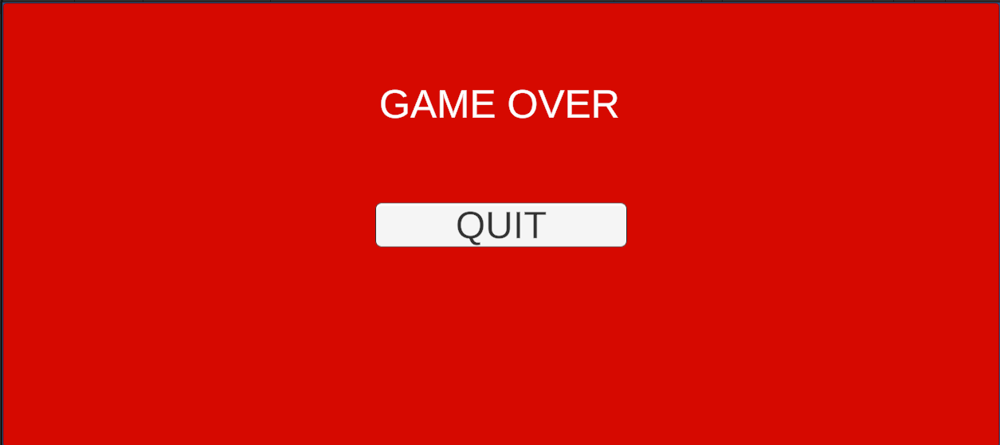

##Rotating Saw

Prvo, redizajnirati ćemo level.


Sada u Pixel Adventure 1, naći folder Saw. Ijseći sliku, napravtit game objekt Rotating Saw, i napraviti animaciju.
Dodati Circle Collider2D i dodati Waypoint Follower. Nparavti wayponits.


Namjestiti da x koordinate budu iste kao u Rotating Saw.
I staviti tag **Trap**.


##Multiple Levels

Sada ćemo dodati još jedan level u našu igru. To ćemo uraditi tako što ćemo staviti trigger na kraj levela. Pa prvo ćemo napraviti novi game objekat.
I nazvati ga Finish. Onda u folderu PA 1 naći folder Checkpoint i isjeći prvu sliku. Nakon toga napraviti animaciju. Game objektu dodati Box Collider 2D i postavti ga na trigger. I staviti ga na kraj levela.


 Nakon toga otići u foleder **Scenes**, preimenovati postojeći scene u Level 1. Prije toga napravidi game objekte kaou što su Player, RS, MP u prefabas
 da možemo ih mjenjati samo jednom za sve levle.
 Klikntui na njega te pritisnuti **Ctrl+D**, da bi napravili još jedan level. Te promijeniti izgled levela da možemo rzlikovati između dva.
 
 

 Nakon toga kliknuti **File->Build Settings**. Te kliknuti **Add Opne Scene**. Pomoću ovoga ćemo u skripti mjenjati level.


Sada ćemo napisati skriptu Finish.

```csharp
using System.Collections;
using System.Collections.Generic;
using UnityEngine;
using UnityEngine.SceneManagement;//uključiti namespace SceneManagement

public class Finish : MonoBehaviour
{
    
    private void OnTriggerEnter2D(Collider2D collision)
    
        if(collision.gameObject.name == "Player")//provjeravamo da li naš game objekt dodiruje Playera
        {
            Invoke("CompleteLevel", 2f);//funkcija Invoke služi nam da se funkcija koja se poziva deleja
            //za određeni broj sekundi, dakle prvi argument je string koji je ime funkcije, a drugi je broj sekundi
            

        }
    }

    private void CompleteLevel()//pravimo funkciju
    {
        SceneManager.LoadScene(SceneManager.GetActiveScene().buildIndex + 1);//ova funkcija učitaje novi level tako što 
        //od starog levela uzme index i doda jedan
    } 
}
```

Dodati skript na game objekt Finish i isprobsti da li radi.
>Napomena: Treba biti pokrenuti prvi level.


##Sound Effect & Music

Sada ćemo dodati muziku i sound efekte u našu igru.
Prvo ćemo naći file-ove za to. Kliknuti **Windows->Asset Store**. Kliknuti na Audio. Te downloadovti ova dva file-a.


Nakon toga otići na **Windows->Package Manager**. Klinuti downolad i import za oba file-a.


Rad sa zvukom u Unity-u zahtjeva dvije stvari **Audio Source** i **Audio Listener**. Main Camera je po defaultu Audi Listener, tako da samo trebamo da odredimo Audio Source-ove. Zbog toga odabrati prefab Player-a i dodati mu komponentu **Audio Source**.
>Napomena: Svaki put kada nešto promijenimo na prefabu, desni klik **Refresh**, ovo će napraviti promijne na svakom to prefab game obijktu u levelima

Sada ćemo odabrati sound efekte za našu igru.

>DM-CGS-21 - Collect(Možete preimenovati, radi lakšeg snalaženja)

>DM-CGS-32 - Jump

>DM-CGS-18 - Finish

>DM-CGS-17 - Death

Sada dodati sound Jump u slot **Audio Clip**


I isklučitit **Play On Awake**
Sada otići u Player Movement skriptu i dodati dvije linije koda.
```csharp
using System.Collections;
using System.Collections.Generic;
using UnityEngine;

public class PlayerMovement : MonoBehaviour
{
    private Rigidbody2D rb;

    public float move_speed = 7f;
    public float jump_speed = 7f; 

    private BoxCollider2D coll;
    [SerializeField] private LayerMask ground;

    private Animator anim;
    private SpriteRenderer sprite;

    float dirX = 0;

    private enum MovementState{idle, run, jump, fall};

    [SerializeField] private AudioSource jumpSoundEffect;//dodajemo polje za naš audio klip

    private void Start()
    {
        rb = GetComponent<Rigidbody2D>();
        coll = GetComponent<BoxCollider2D>();
        anim = GetComponent<Animator>();
        sprite = GetComponent<SpriteRenderer>();
    }

    
    private void Update()
    {
        dirX = Input.GetAxis("Horizontal");
        rb.velocity = new Vector2(dirX * move_speed , rb.velocity.y);

        if(Input.GetButtonDown("Jump") && IsGrounded())
        {
            rb.velocity = new Vector2(rb.velocity.x,jump_speed);
            jumpSoundEffect.Play();//ova funkicija pušta audio klip
        }
        Animation();
    }

    .
    .
    .

```
Sada drag & drop audio source u polje u Player Movement skripti.


Sada ćemo istu stvar uradtit i za collect i death audio.
Dodati još audio source za collect i death i ubaciti audio klipove.
```csharp
using System.Collections;
using System.Collections.Generic;
using UnityEngine;
using UnityEngine.UI;
using TMPro;

public class ItemCollector : MonoBehaviour
{
    private int apple = 0;
    [SerializeField] private TMP_Text itemText;

    [SerializeField] private AudioSource collectSoundEffect;//dodajemo polje za naš audio klip


    private void OnTriggerEnter2D(Collider2D collision)
    {
        if(collision.gameObject.CompareTag("Apple"))
        {
            Destroy(collision.gameObject);
            collectSoundEffect.Play();//ova funkicija pušta audio klip
            apple++;
            itemText.text = "Score: " + apple;
        }
    }
}

```
I death audio klip

```csharp
using System.Collections;
using System.Collections.Generic;
using UnityEngine;
using UnityEngine.SceneManagement;

public class PlayerDeath : MonoBehaviour
{
    private Animator anim;
    private Rigidbody2D rb;
    [SerializeField] private AudioSource deathSoundEffect;//dodajemo polje za naš audio klip

    void Start()
    {
        anim = GetComponent<Animator>();
        rb = GetComponent<Rigidbody2D>();
    }


    private void OnCollisionEnter2D(Collision2D collision)
    {
        if(collision.gameObject.CompareTag("Trap"))
        {
            Die();
        }
    }

    private void Die()
    {
        rb.bodyType = RigidbodyType2D.Static;
        deathSoundEffect.Play();//ova funkicija pušta audio klip
        anim.SetTrigger("death");
    }

    private void RestartLevel()
    {
        SceneManager.LoadScene(SceneManager.GetActiveScene().name);
    }
}
```

Za Finish ćemo na prefab od game objekta Finish dodati komponentu Audio Spurce i audio klip Finish.
Te dodatdi u skripti Finish dodati kod za audio.

```csharp
using System.Collections;
using System.Collections.Generic;
using UnityEngine;
using UnityEngine.SceneManagement;

public class Finish : MonoBehaviour
{
    [SerializeField] private AudioSource finishSoundEffect;//dodajemo polje za naš audio klip

    private bool levelCompleted = false;//pravimo varijablu za provijeru da li smo već dodirnuli finish
    
    private void OnTriggerEnter2D(Collider2D collision)
    {
        if(collision.gameObject.name == "Player" && levelCompleted == false)//provijeravamo da li smo prije dodirnuli finish
        //ovo radimo zbog toga što bi se audio klip puštao svaki put kada dodirnemo finish
        //ako nismo ovo će se samo jednom izvršiti
        {
            finishSoundEffect.Play();//ova funkicija pušta audio klip
            levelCompleted = true;//postavljamo levelCompleted na true
            Invoke("CompleteLevel", 2f);
            

        }
    }

    private void CompleteLevel()
    {
        SceneManager.LoadScene(SceneManager.GetActiveScene().buildIndex + 1);
    }

    
}
```
I još na kraju Background music. Napraviti **Empty Game Object** i dodati Audio Source kompnentu. Odabrati jedanu melodiju iz CasualGameBGM05.
U Audio source checkirati Play on Awake & Loop, te smanjiti Volume po želji.


##Start & Game Over Menu

U folderu Scene desni klik **Create->Scene**. Nazvati je Start Menu. Pokrenuti Main Menu scenu.
U Hierarchy desni klik **UI->Pnael**.  Sada promijenti boju po želji i dodati tekst. I dodati dugme. Desni klik na Panel **UI->Button**.


Sada ćemo naprviti sktiptu koju ćemo dodati na button da možemo pokrentui igru.

```csharp
using System.Collections;
using System.Collections.Generic;
using UnityEngine;
using UnityEngine.SceneManagement;

public class GameStart : MonoBehaviour
{
    public void StartGame()
    {
        SceneManager.LoadScene(SceneManager.GetActiveScene().buildIndex +1);//funkcija koja uzima index od aktivne
        scene i dodajemo +1
    }
}

```
Sada u **Build Settings** postaviti start menu na 0-ti inedx.


Dodati skriptu na Button. I kliknuti + na **On Click**. Drag & Drop skriptu u polje ispod **Runtime On**. I izabrati funkciju **StartGame**.


Sada u Scene folderu doati još jednu scenu i nazvati je Game Over. Ponovo dodati panel i button. Button će nam služiti za izlaženje iz igre.
Te napraviti skriptu GameEnd.

```csharp
using System.Collections;
using System.Collections.Generic;
using UnityEngine;

public class GameEnd : MonoBehaviour
{
    public void Quit()
    {
        Application.Quit();//funkcija quit zatvara aplikaciju
        //Napomena ovo samo radi kada se igra builda, tako da sada u preview neće raditi
    }
}

```

Ponovo dodati skriptu na button i  Drag & Drop skriptu u polje ispod **Runtime On**. I izabrati funkciju **Quit**. I u Build Settings dodati Game Over level.


