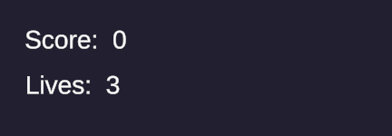
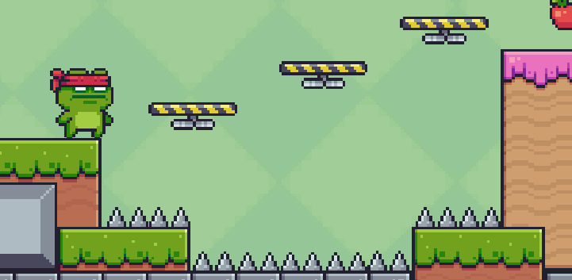
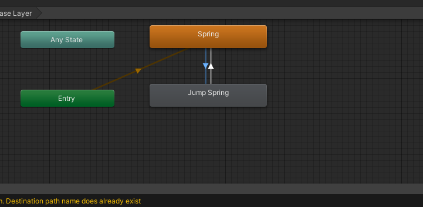
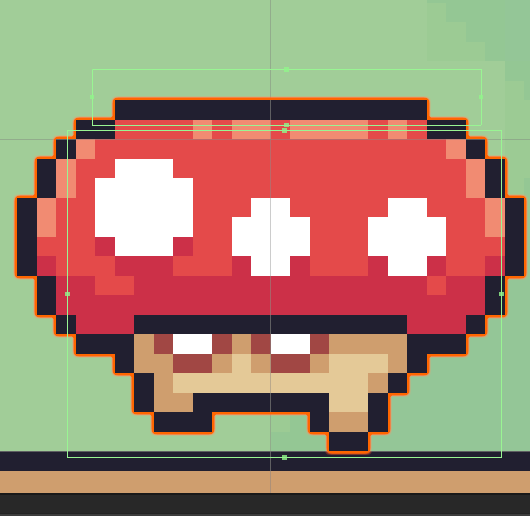

##Broj života

Sada ćemo napraviti da nam igrač ima 3 života.
Otvoriti skriptu PlayerDeath

```csharp
using System.Collections;
using System.Collections.Generic;
using UnityEngine;
using UnityEngine.SceneManagement;

public class PlayerDeath : MonoBehaviour
{
    private Animator anim;
    private Rigidbody2D rb;
    [SerializeField] private AudioSource deathSoundEffect;
    private static int lives = 3;//napraviti static varijablu lives
    //static jer kada Player umre da se vrijednost varijable ne resetuje

    void Start()
    {
        anim = GetComponent<Animator>();
        rb = GetComponent<Rigidbody2D>();
    }


    private void OnCollisionEnter2D(Collision2D collision)
    {
        if(collision.gameObject.CompareTag("Trap"))
        {
            Die();
        }
    }

    private void Die()
    {
        rb.bodyType = RigidbodyType2D.Static;
        deathSoundEffect.Play();
        anim.SetTrigger("death");
        
        
    }

    private void RestartLevel()
    {
        lives--;//smanjiti lives za 1
        if(lives > 0)//postaviti ulsov
        {
        SceneManager.LoadScene(SceneManager.GetActiveScene().name);//restartovanje levela
        }   
        else//ako je broj života 0
        {
            SceneManager.LoadScene("Game Over");//učitati level Game Over
        }
    }

}
```

U game objektu Canvas, gde je tekst za iteme dodati tekst za živote. I postaviti ispod Score.

 

I onda u kod dodati još dio za ispis broje života.

```csharp
using System.Collections;
using System.Collections.Generic;
using UnityEngine;
using UnityEngine.SceneManagement;
using TMPro;//dodati namespace TMPro

public class PlayerDeath : MonoBehaviour
{
    private Animator anim;
    private Rigidbody2D rb;
    [SerializeField] private AudioSource deathSoundEffect;
    [SerializeField] private TMP_Text livesText;//napraviti varijablu livesText
    private static int lives = 3;

    void Start()
    {
        anim = GetComponent<Animator>();
        rb = GetComponent<Rigidbody2D>();
    }
    private void Update()//dodati Update funkciju
    {
        livesText.text = "Lives: " + lives;//naredba za ispisživota
    }


    private void OnCollisionEnter2D(Collision2D collision)
    {
        if(collision.gameObject.CompareTag("Trap"))
        {
            Die();
        }
    }

    private void Die()
    {
        rb.bodyType = RigidbodyType2D.Static;
        deathSoundEffect.Play();
        anim.SetTrigger("death");
        
        
    }

    private void RestartLevel()
    {
        lives--;
        //livesText.text = "Lives: " + lives;
        if(lives > 0)
        {
        SceneManager.LoadScene(SceneManager.GetActiveScene().name);
        }   
        else
        {
            SceneManager.LoadScene("Game Over");
        }
    }

}
```


##Falling Platforms

Npraviti game objekt Falling Platform
U PA1 naći folder Falling Platforms, isjeći sliku i napraviti animaciju. Dodati Box Collider 2D i namijestiti odgovarajuću veličinu.
Zatim dodati Rgigd Body 2D i napraviti da BOdy Type bude **Static**. 
Sada ćemo napisati skriptu.

```csharp
using System.Collections;
using System.Collections.Generic;
using UnityEngine;

public class FallingPlatfrom : MonoBehaviour
{
    private Rigidbody2D rb;//napraviti varijablu tipa RigidBody2D
    private bool isFalling = false;//
    public float delayFall = 1f;//varijbala za delay za padanje platforme
    public float delayDestroy = 1f;//varijabla za delay za uništenje platforme


    private void Start()
    {
        rb = GetComponent<Rigidbody2D>();//dodajemo komponentu RigidBody
    }

    private void OnCollisionEnter2D(Collision2D collision)
    {
        if (collision.gameObject.name == "Player" && !isFalling)//provjeravomo da li game objekt ima ime Player
        //da li je već dodirnuo platformu, da se funkija Fall ne bi zvala ponovo svaki put 
        {
            Invoke("Fall", delayFall);//invoke poziva funkciju sa deleyom za određeni broj sekundi
            isFalling = true;//postavljamo isFalling na true
        }
    }

    private void Fall()
    {
        rb.bodyType = RigidbodyType2D.Dynamic;//stavljamo da je body type dynamic da platforma pada
        Invoke("DestroyPlatform", delayDestroy);//pozivamo kroz invoke funkciju DestroyPlatform za određeni broj sekundi
    }

    private void DestroyPlatform()
    {
        Destroy(gameObject);//uništava game objekt
    }
}
```

Dodati skriptu na game objekt i napraviti objekt prefab.

>Napomena: Staviti **Layer** na **ground** da bi igrač mogao da skače kada se nalazi na platformi.

Namjestiti vrijeme padanja i uništenja, i isprobati u igri.



##Jump Springs/Trampoline

Napraviti novi game objekt i nazvati ga Jump Spring.
U foldru PA1 naći folder Trampoline, isjeći sliku i napraviti animaciju, i idle animacjiu samo sa idle slikom. U Animatoru napraviti bool parameatar isJumped i postaviti ga u transicijama između idle i jump animacije.



Idle -> Jump - condition postaviti na ture.

Jump -> Idle - false.

Dodati Box Collider na game objekt. Sada ćemo napisati skriptu.

```csharp
using System.Collections;
using System.Collections.Generic;
using UnityEngine;

public class Spring : MonoBehaviour
{
    private Animator anim;//pravimo varijablu anim
    public float jumpforce = 11f;//varijablu jumpforce

    void Start()
    {
        anim = GetComponent<Animator>();    
    }


    private void OnCollisionEnter2D(Collision2D collision)
    {
        if(collision.gameObject.name == "Player")
        {
            anim.SetBool("isJumped", true);//postavljamo isJumped ulov za animaciju na true
        }
        if(collision.relativeVelocity.y <= 0f)
        {
            Rigidbody2D rb = collision.collider.GetComponent<Rigidbody2D>();//pravimo varijblu rb tipa rigidbody
        //koja uzima rigidbody od game objekta sa kojim se spring dodiruje, tj. od igrača
            if(rb != null)
            {
                Vector2 velocity = rb.velocity;//pravimo nvu varijablu velocity tipa vector, koji uzima  brzinu od igrača
                velocity.y = jumpforce;//brzinu po y osi postavljamo na naš jumpforce
                rb.velocity = velocity;//igraču postavljamo novu brzinu

            }
        }
    }
    private void OnCollisionExit2D(Collision2D collision)
    {
        if(collision.gameObject.name == "Player")
        {
            Invoke("isJumped",0.25f);//ovdje je invoke zbog toga da se jump animacija od springa izvrši
            //uprotivnom će odma prebaciti na idle animation
        }
        
    }

    private void isJumped()
    {
        anim.SetBool("isJumped", false);//postavljamo isJumped ulov za animaciju na false
    }
}

```

>Napomena: Postaviti **Layer** game objekta na **gruond**.

##Enemies

Sada ćemo napraviti enemies za našu igru. Sprites za enemies download-ati na [linku](https://pixelfrog-assets.itch.io/pixel-adventure-2) ili na github-u. Napraviti novi game objekt Enemie i odabrati jednog od enemia, isjći run i hit sliku i napravitzi animacije. I napraviti transition iz Run -> Hit, sa triggerom **hit**. Dodati Box Collider 2D  i postaviti tag na **Trap**. Sada ćemo za kretanje koristiti skriptu WaypointFollower, koju ćemo malo editiovati
```csharp
using System.Collections;
using System.Collections.Generic;
using UnityEngine;

public class WaypointFollower : MonoBehaviour
{
    [SerializeField] private GameObject[] waypoints;
    private int currentIndex = 0;
    public bool isEnemie = false;//dodati varijeblu koja će nam sužiti da provjeravamo da li je game objekt enemie

    private SpriteRenderer sprite;//dodati vatijablu sprite
    [SerializeField] private float speed = 2f;

    private void Start()
    {
        sprite = GetComponent<SpriteRenderer>();//dodati u nju komponentu SpriteRenderer
    }

    private void Update()
    {
        if(Vector2.Distance(waypoints[currentIndex].transform.position, transform.position) < 0.1f)
        {
            currentIndex++;
            if(currentIndex >= waypoints.Length)
            {
                currentIndex = 0;
            }
            if(isEnemie)//ako je game objekt enemie
            {
                sprite.flipX = !sprite.flipX;//flipati mu sprite po x osi
                //tj. da nam se enemie okrene kada dođe do waypointa
            }
        }
        transform.position = Vector2.MoveTowards(transform.position, waypoints[currentIndex].transform.position, Time.deltaTime*speed);
    }
}

```

Sada ćemo da napravimo da enemie bude uništen kada mu igrač skoči na glavu. Dodati još jedan Box Collider 2D i njega postaviti da bude **Trigger**.



I još ćemo napreviti da igrač dobije bodove kada ubije enemia. Pa u ItemCollector skripti varijablu **apples** postaviti na **public static**, da bi joj mogli pristupiti iz drugoe skripte, tj. da bude globalna varijabla.


```csharp
using System.Collections;
using System.Collections.Generic;
using UnityEngine;

public class EnemieHit : MonoBehaviour
{
    private Animator anim;//dodati varijablu anim
    public int hitPoints = 5;//dodati varijablu za broj bodova

    private void Start()
    {
        anim = GetComponent<Animator>();//dodati komponentu Animator
    }

    private void OnTriggerEnter2D(Collider2D collision)
    {
       if(collision.gameObject.name == "Player")//porvjeriti da li je game objekt Player
       {
        ItemCollector.apple += hitPoints;//prstupamo varijabli apple iz skripte ItemCollector i dodajemo joj bodove
        ChangeTag("Untagged");//mijenjamo tag u Untagged da nam Player ne umre, jer će dotaknuti donji Collider
        //a to će izazvati smrt Playera
        anim.SetTrigger("hit");//stavimo trigger za animaciju
       }
    }

    private void DestroyObj()
    {
        Destroy(gameObject);//uništavamo objekt
    }
    
    void ChangeTag(string newTag)//funkcija kojom mijenjamo tag game objekta
    {
        
        gameObject.tag = newTag;
    }
}
```


I pokrenuti igru i provjeriti da li radi, i napraviti Enime prefab.

Na karju u **Build Settings** kliknuti **Build and Run** što će napravtit aplikaciju za igru.

<iframe width="800" height="400" src="igra.mp4" frameborder="0" allowfullscreen></iframe>
