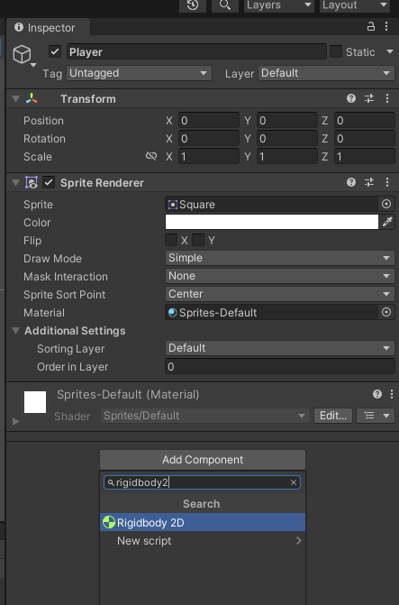
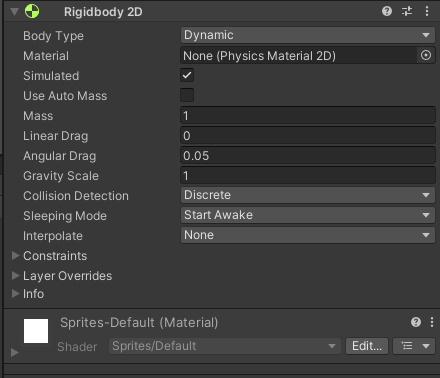
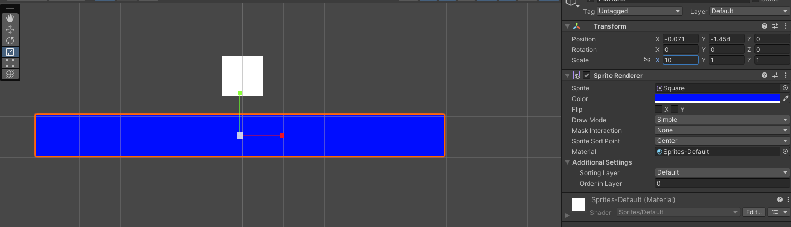
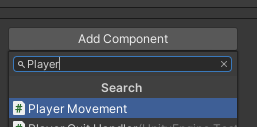
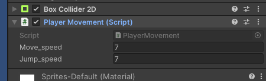
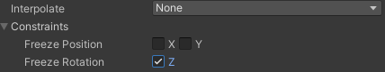
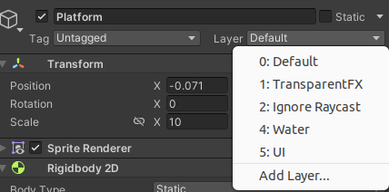
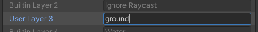
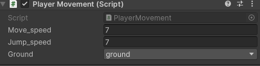
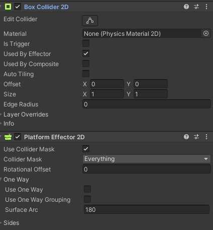

##Fizika

Dupli klik na game objekt player. Te otići na prozor Inspector, tu se nalaze inforamcije vezane za game objekt.
>**Transform** - pokazuje poziciju, rotaciju i veličinu igrča.

>**Sprite Renderer** - pokazuje inforamcije vezane za izgled game objekta.

Kliknuti na **Add Component** i napisati **Rigidbody 2D**




 **Rigidbody 2D** je  komponenta koja je zadužena za fiziku game objekta.

 Sada napraviti novi game objekt, koji ćemo nazvait Paltform. Kliknuti na Platform, te ga skalirati Sacle X = 10. I pormjenuti mu boju u Sprite Rendereru.



Takode, dodati Rigidbody 2D i staviti **Body Type** **Static**

**Static** zanači kada se igra pokrene da na game objekt neće djelovati garvitacija i game objekt se neće pomjerati.

**Dynamic** znači da na game object djeluje gravitacija i tijelo može da se pomjera.

Sada ponovo kliknuti na Player i na inspector, Add Component **Box Collider 2D**

**Box Collider 2D** služi da bi se oko game objekta napravio hit box, te bi onda game objekt pravio interakcije sa drugim game objektima, i ne bi prolazio kroz njih.

Dodati Box Collider 2D i na Platform.

Pomjeriti Player-a iznad Platform-e tako da bude prostora između njih te pokrenuti igru. Player bi trebao pasti na Platformu i ostati na njoj.s

##Kretanje

U prozoru za pretraživnje failova u folderu Assets, desni klik **Create --> Folder**. Folder nazvati Scripts. Kliknuti na njega, te ponovo desni klik **Create --> C# Script**. Skriptu nazvati PlayerMovement.

Sada pokrenuti skriptu.

```csharp
using System.Collections;
using System.Collections.Generic;
using UnityEngine;

public class PlayerMovement : MonoBehaviour
{
    //Start() i Update() su dvije osnovne funkcije
    //Start je funkcija/metoda koja se poziva samo jednom prije prvoga farme-a
    //To se obicno se u varijable dodjeljuju/uzimaju vrijednosti komponenate od game objekta iz inspectora
    void Start()
    {
        
    }

   //Update se poziva svaki frame te izvrsava naredbe koje se tu nalaze
    void Update()
    {
        
    }
}

```

Sada napišimo kod za kretanje i skakanje Player-a.

```csharp

using System.Collections;
using System.Collections.Generic;
using UnityEngine;

public class PlayerMovement : MonoBehaviour
{
    private Rigidbody2D rb;//deklarisanje varijeble rb tipa Rigidbody2D
    public float move_speed = 7f;//deklarisanje i inicijalizija varijable move_speed, koja odrađuje brzinu kretanja Player-a 
    public float jump_speed = 7f;//deklarisanje i inicijalizija varijable jump_speed, koja odrađuje brzinu skakanja Player-a 
    //deklarisanje varijable na public omogućava mjenjanje vrijednosti varijable unutar komponente u Inspectoru

    private void Start()
    {
        rb = GetComponent<Rigidbody2D>();//u varijablu inicijaliziramo virjednosti komponente Rigidbody2D iz inspectora
    }

    
    private void Update()
    {
        float dirX = Input.GetAxis("Horizontal");//varijabla u kojoj inicijaliziramo vrijednosti koje dobijemo kada pritisnemo tipke "<-" i "->"
        //pritisak tipke "<-" postavlja vrijednost -1, a tipka "->" postavlja vrijednost 1
        //takođe, ako imamo joystick vrijednost može da bude između -1 i 1
        //ova vrijednost će nam govoriti u koju stranu se Player kreće
        
        rb.velocity = new Vector2(dirX * move_speed , rb.velocity.y);//mjenjanje vrijednosti brzine tijela Player-a
        //Vector2 je tip poidatka koji ima dvije vrijednosti
        //prva ovdje prestavlja brzinu po x-osi, a druga po y-osi
        //sa varijablom dirX mjenjamo smijer kreatnja Player-a
        //brzina po y-osi ostaje ista

        if(Input.GetButtonDown("Jump"))//provjeravamo da li je pritisnut space ili određeno dugme za skakanje
        {
            rb.velocity = new Vector2(rb.veocity.x,jump_speed);//mjenjnje vrijdnosti brzine po y-osi
            //brzina po x-osi ostaje ista
        }
    }
}

```
Pritisnuti Ctrl+S, te se vratiti u Unity.
Kliknuti na Player, te u inspectoru kliknuti **Add Component**.
Napisati **PlayerMovement** i dodati ga Player-u.



Kompoineta Player Movement izgleda ovako



Tu sada možemo mjenjati move_speed i jump_speed kako nama odgovara.

Sada otići na komponentu Rigidbody2D, **Constraints** i checkirati **freeze rotation Z**.



Da se tijelo ne rotira kada skače.

##Ground Check

Primjetimo sada da nam Player može da skače "beskonačno".
Da bi smo to spriječli, provjeravati ćemo da li nam game objekat Player dodiruje "tlo", i ako dodiruje tek onda može da skoči.

Sada ćemo napraviti funkiciju IsGrounded koja nam to omogućava.
Otvorimo PlayerMovement skriptu.

```csharp
using System.Collections;
using System.Collections.Generic;
using UnityEngine;

public class PlayerMovement : MonoBehaviour
{
    private Rigidbody2D rb;
    public float move_speed = 7f;
    public float jump_speed = 7f; 

    private BoxCollider2D coll;//deklaracija varijable tipa BoxCollider2D
    [SerializeField] private LayerMask ground;//deklaracija varijable tipa LayerMask, u koju ćemo staviti kasnije naše "tlo"(layer za tlo)

    private void Start()
    {
        rb = GetComponent<Rigidbody2D>();
        coll = GetComponent<BoxCollider2D>();//inicijalizacija vrijednosti iz BoxCollider2D
    }

    
    private void Update()
    {
        float dirX = Input.GetAxis("Horizontal");
        rb.velocity = new Vector2(dirX * move_speed , rb.velocity.y);

        if(Input.GetButtonDown("Jump") && IsGrounded())//dodati još jedan uslov
        {
            rb.velocity = new Vector2(rb.velocity.x,jump_speed);
        }
    }

    private bool IsGrounded()//funkcija
    {
        return Physics2D.BoxCast(coll.bounds.center, coll.bounds.size, 0f, Vector2.down, .1f, ground);
        //Physics2D.BoxCast je funkcija koja oko game objekta pravi nešto kao hitbox, slično kao BoxCollider2D
        //BoxCast će provjeravati šta Player dodiruje
        //coll.bounds.center, kada se pravi BoxCast on će da ima oblik kao box collider, i sa ovime ćemo da ga postavimo u na istu poziciju
        //coll.bounds.size da CastBox ima istu veličinu kao i box collider
        //0f je za ugao rotacije
        //Vector2.down govri da će se box cast pomjerti na dole
        //.1f govori za koliko da se pomjeri
        //ground je layer koji BoxCast treba da detektujue 
        //funkcija vraća bool, true ako Player dodiruje tlo(ground)
    }
}

```
Dakle, oko Payera smo napravili BoxCast koji izgleda kao box collider, ali je pomjeren na dole za .01f(jako jako malo)
i provjerava da li Player dodiruje tlo(ground). 
Korist ove funkcije jeste da ako Player bude dodirivao tlo(ground) sa strane, BoxCast neće da detektuje to kao ground. Pa Player neće moći da skače po "zidovima".
Sada kliknuti na game objekat Platform, kliknuti na **Layer**, ,te **add layer**.
Te u prvo slobodno mjesto upisati **ground**, pritisuti enter te ponovo kliknuti na game objekat Platform, kliknuti na **Layer**, ,te **add layer**, sada odabrati **ground**




Sada kliknuti na game objekt Player, te otići na komponentu Player Movement, sada treba da se tu još nalazi i opcija **Ground**, te tu odabrati ground.



Sada kad pokrenemo igru Player može da skoči samo jednom i to ako dodiruje tlo.
Iako Player ne može da skače po zidovima i dalje može da se zalijepi za njih.
Pa zbog toga na game objekat Platform dodati komponentu **Platform Effector 2D**. Uncheckirati **Use One Way** i checkirati u **Box Collider 2D Used By Effector**.



I sada se Player neće da lijepi po zidovima.