##Assets

Asseti za našu igru biće na github-u.
Pa ih tu možete download-ati.
Onda ih impotrujte u Unity u folder **Assets**.
Ili na [linku](https://pixelfrog-assets.itch.io/pixel-adventure-1) 

##Tilemap

Sada ćemo da počnemo da pravimo naš level. Za to ćemo da koristimo **Tilemap**. Sada u **Hierarchy** desni klik.

**2D Object** --> **Tilemap** --> **Rectangular**
Nazvati tilemap Terrain.
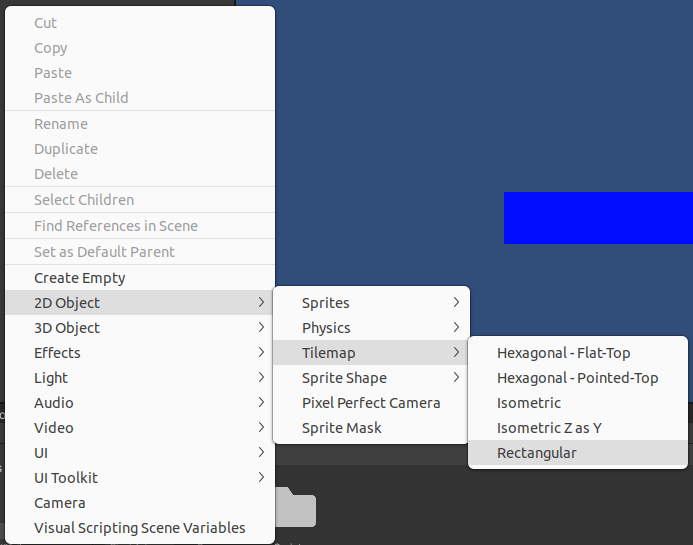

Tilemap funkcioniše tako što nam ekran podijeli na kvadrate, u našem slučaju 16x16 pixela, u koje možemo da postavimo assete.

Sada otvoriti **Tile Pallete**.
**Window --> 2D --> Tile Pallete**

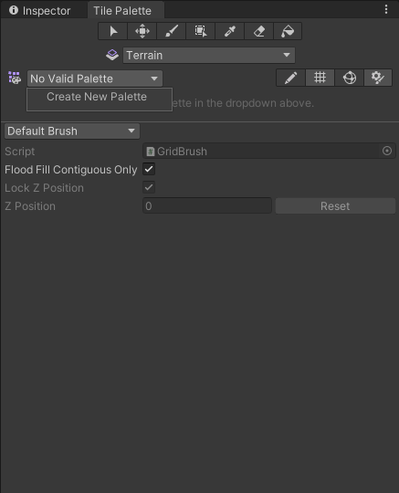
Kliknuti **Create New Pallete** i nazvti je Terrain i sačuvati je u folder Assets.
Obrisati game objekt Platform.
I otići u folderu Pixel Adveture 1 u folder Terrain. Naći  sliku Terrain i klinuti na nju.
U Inspectoru postaviti 
>>Sprite mode na **Multiple**

>>Pixels Per Unit na 16

>>Filter Mode na Point(no filter)

I kliknuti Apply.

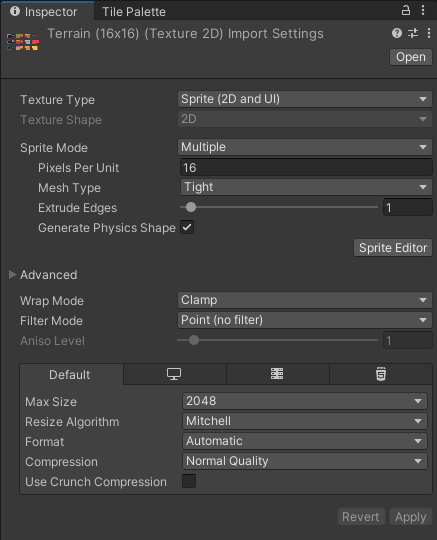

##Crtanje Levela

Sada kliknuti **Sprtie Editor**, da bi smo isjekli sliku na 16x16 px dijelove.
Lijevi gornji ugao **Slice --> Type --> Grid By Cell Size**.

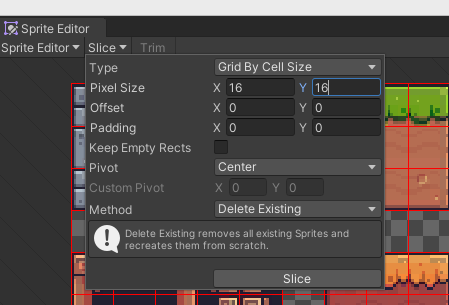

Sada otići  an **Tile Pallete** i drag & drop sliku Terrain u nju.

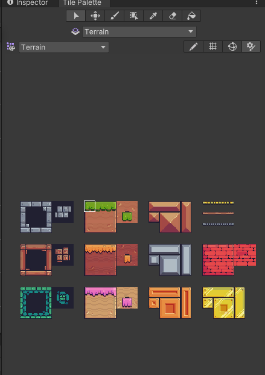

Kada to uradite, sačuvait paletu u novi folder Tiles.
I sad kada kliknete na kliknete na četkicu u Tile Pallete ili stisnete B možete crtati po prozoru.

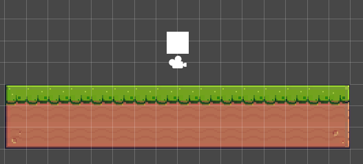

Sada u **Hierarchy** desni klik na **Grid** --> **2D Object** --> **Tilemap** --> **Rectangular**.
Nazvati tilemap Background. Sada u folderu PA1 naći Bacground i izabrati jedan.
U Inspectoru uraditi ponovo postavke kao i kod Terraina. I isjeći isto. 

Sada otići na Tile Palette i drag & drop. Kliknuti na Background u Hierarchy i u **Tilemap Renderer** postaviti **Oredr in Layer** na -1.

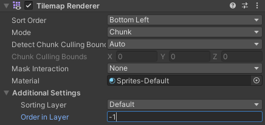

Ovo nam omogućava da nam background bude iza terraina. Sada sa Tile Palletom nacrtati backgound.

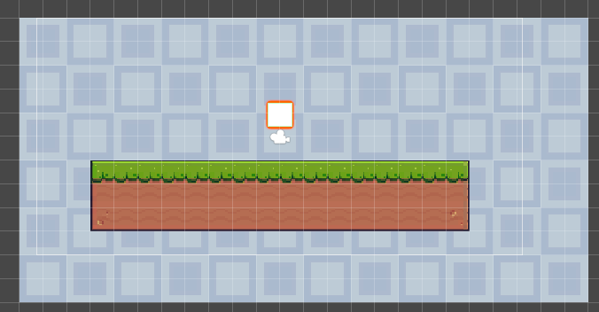

>Napomena: provjeri da li je u Tile Palletu odabran background.

Sada klknuti na game objekt Terrain i otići na Inspector.
Dodati komponente **Tilemap Collider 2D**. Tilemap Collider 2D kao i Box Collider pravi oko game objekta hit box, samo što Tilemap Collider pravi oko svakog kvadratića što smo nacratali pojedinačno. Pošto ćemo mi kroz igru koriti samo prve redove kvadratića od Terraina. Da bi smo napravili samo da nam Collider bude oko čitavog terraina korititi ćeamo **Compostie Collider 2D**. Također dodati **Platform Effector 2D**. I postaviti  Layer **Ground** na vrhu.

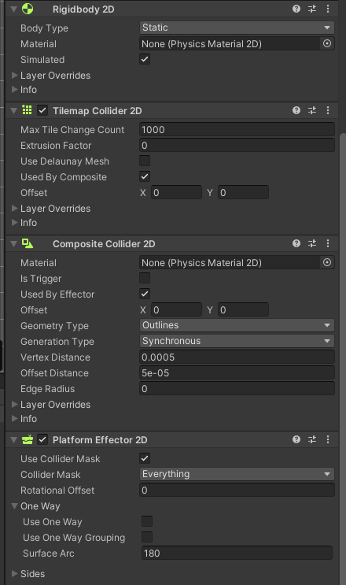

Sada pokrenuti igru i provejriti da li je sve uredu.
>Napomena: Ako treba dodati Rigidbody 2D i postavit Body Type na Static.

Sada možemo otići u folder Main Characters i odabrati jednog, te naći sliku Idle(napravit postavke kao i za Terrain, ali kad se bude sijeklo isjeći na 32x32). Te kliknuti na game objekat Player i u Inspectoru otići na **Sprite Renderer** te u **Sprite** ubaciti prvu sliku.

>Napomena: Ako slika bude izgledala čudno, stavti Compression na None.

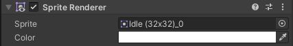

Onda Box Collider namjetiti da odgovara slici.

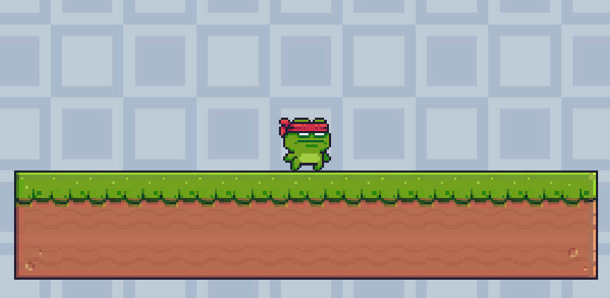

