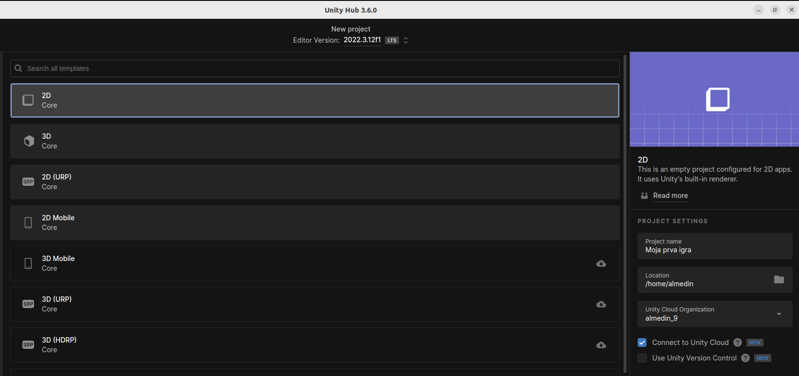
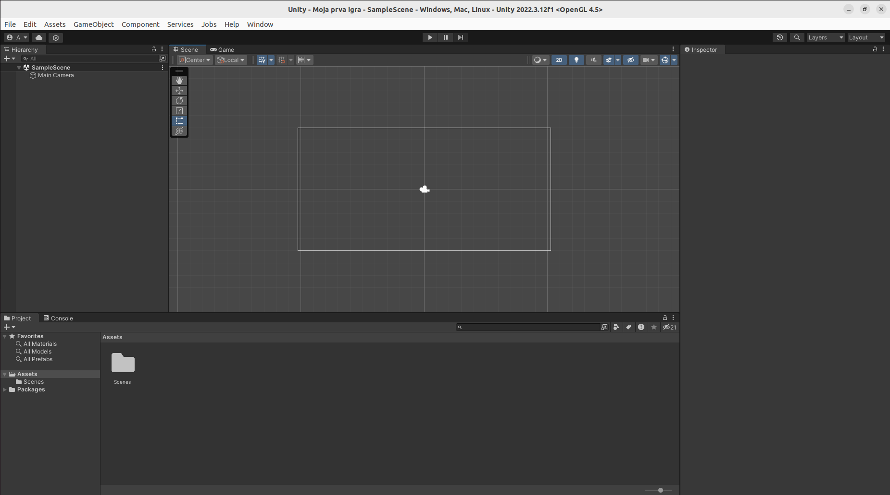
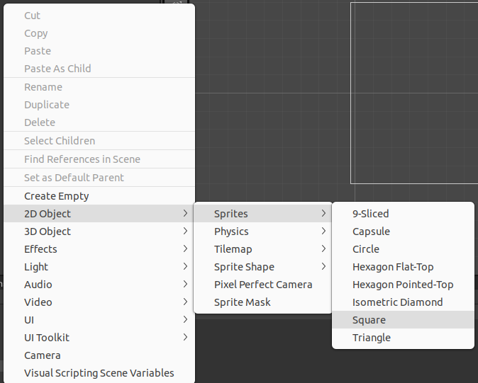

#Uvod
**Unity** je popularan cross-platform game engine. Koristi se ra razvoj 3D, 2D, desktop, mobile, console i VR igara. Koristi programski jezik C#.
Mi ćemo praviti 2D desktop platformer igru(Platformer je igra u kojoj se igrač prealzi prepreke koristeći sposobnosti kao skakanje i penjanje, npr. Super Mario).

Kada pokrenemo Unity Hub, kiknuti dugme **New project**. 
Te odabrati **2D core** i napisati ime svog projekta.

Te onda kiknuti dugme **Create project**.

Sada se upoznajemo sa layout-om Uinty-a.

>**Hierarchy** -  unutar toga će se nalaziti naši game objekti. Sample scene je level u kojem se nalazimo trenutno. 

>**Scene** - prozor koji nam pokazuje pravi izgled igre. Tu se edituje igra.  

>**Game** - porzor u kojem vidimo izgeld igre kada se on igra.

>**Inspector** - prozor koji nam pokazuje informacije o game objektu kojeg posmatarmo. Takođe se koristi za dodavanje komponenti game objektu.

>Prozor za orijentaciju i prataživanje failova.

Iznad Scene/Game prozora se nalaze dugmad za pokretanje i zaustavljanje igre.

Da bi smo napravili game objekt, odemo mišem na Hierarchy i kliknemo desni klik. Pojaviti će se meni sa opcijama i odabrati 2D Object ->Sprites -> Square.

 
Kada to uradimo, imenovati game objekt Player. Te će se na ekranu pojaviti bijeli kvadrat. 
I to je naš prvi game objekat.
